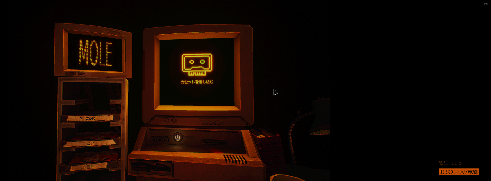

# M.O.L.E 한국어 패치 🇰🇷

[English](README.en.md) · 비공식 팬 번역

Steam 심리 호러 게임 **[M.O.L.E](https://store.steampowered.com/app/4064510/MOLE/)**(개발: Z Labs)의 **비공식 팬 한국어 패치**입니다. 게임은 공식 한국어를 지원하지 않기 때문에, 이 패치는 **사용되지 않는 일본어(日本語) 로케일 슬롯을 한국어로 덮어쓰는** 방식으로 동작합니다. 게임 안에서 언어를 일본어로 선택하면 화면이 한국어로 나옵니다.

> ⚠️ 비공식 패치입니다. 게임을 **정식으로 소유한** 사용자만 사용하세요. 자세한 고지는 [DISCLAIMER.md](DISCLAIMER.md) 참고.

> 🤖 이 패치의 거의 모든 과정 — 역공학·폰트 해결·1,300개 문자열 번역·전수 검증·문서화 — 이 **[Claude Code](https://claude.com/claude-code)로 수행**되었습니다. 사람-AI 협업의 전 과정과 한계는 **[MADE-WITH-CLAUDE-CODE.md](MADE-WITH-CLAUDE-CODE.md)** 에 정리되어 있습니다.



<!-- 추가 인게임 스크린샷: docs/img/ 에 넣고 아래 주석을 해제하세요 -->
<!--  -->

---

## 목차
- [⚡ 빠른 설치 (프리빌트)](#-빠른-설치-프리빌트)
- [🔧 직접 빌드 (소스)](#-직접-빌드-소스)
- [동작 원리](#동작-원리)
- [저장소 구조](#저장소-구조)
- [핵심 사실](#핵심-사실)
- [라이선스 · 크레딧](#라이선스--크레딧)

---

## ⚡ 빠른 설치 (프리빌트)

대부분의 사용자에게 권장하는 방법입니다. **파일 하나만 넣으면 끝**입니다.

1. [GitHub Releases](../../releases)에서 **`Mole-Windows_P.pak`** 를 다운로드합니다. (압축파일 아님)
2. 게임 폴더를 엽니다 — Steam 라이브러리에서 **M.O.L.E 우클릭 → 관리 → 로컬 파일 보기**.
   열린 창에서 **`Windows` → `Mole` → `Content` → `Paks`** 폴더로 들어가, 받은 파일을 그 안에 넣습니다.
3. ⚠️ **가장 중요** — 게임 실행 → **설정 → 언어 → `日本語`(일본어)** 선택.
   목록에 "한국어"는 없습니다. **한국어를 일본어 자리에 넣은 방식**이라 `日本語`를 골라야 한글이 나옵니다.
4. 한국어로 표시됩니다. 🎉

**제거**는 넣었던 `Mole-Windows_P.pak` 파일을 삭제하면 됩니다. 원본 파일을 덮어쓰지 않으므로 안전합니다.

> 무결성 확인 (선택):
> ```
> SHA256  4fca7ae0c9d9c07cc96054adf472f58ff4af0b65553257aa79b203637a8a859a
> ```

---

## 🔧 직접 빌드 (소스)

번역 데이터에서 패치 pak을 직접 생성합니다. 이 저장소에는 **게임 원본 에셋이 포함되어 있지 않으며**, 빌드 시 당신이 소유한 게임 설치본에서 원본 파일을 읽어 패치를 만듭니다. 빌드는 **결정적(deterministic)** 이라, 같은 게임 버전(build 1.1.5)과 같은 폰트로 빌드하면 위의 프리빌트와 **바이트 단위로 동일한** pak이 생성되어 SHA256까지 일치합니다. (`build.py`가 repak을 단일 스레드로 호출해 재현성을 보장합니다.)

요구 사항: Python 3.8+, [repak](https://github.com/trumank/repak)

```bash
# 1) repak 설치 (Linux / macOS / WSL)
bash scripts/setup_tools.sh

# 2) 빌드 + 게임에 바로 설치
python tools/build.py --game "/path/to/steamapps/common/M.O.L.E" --install
```

빌드 과정: 게임의 레거시 `Mole-Windows.pak` 추출 → `data/`의 번역을 `Game.locres`·`Engine.locres`에 적용 → 폰트 6종을 한글 폰트로 교체 → 원본과 동일한 `version/mount/seed`로 재패킹 → `Mole-Windows_P.pak` 생성.

> Windows 사용자는 WSL을 사용하거나 [repak 릴리스](https://github.com/trumank/repak/releases)에서 바이너리를 직접 받아 `--repak` 로 경로를 지정하세요.

---

## 동작 원리

한 줄 요약: **게임 텍스트(`Game.locres`)와 엔진 키 이름(`Engine.locres`)을 한국어로 번역하고, 게임의 픽셀 폰트 6종을 한글이 들어있는 폰트로 교체한 뒤, 우선순위가 높은 `_P.pak`으로 덧씌운다.**

전체 추론·접근·의사결정 과정은 [`docs/`](docs/)에 상세히 기록되어 있습니다:

| 문서 | 내용 |
|---|---|
| [01-approach](docs/01-approach.md) | 전략 개요 — 일본어 슬롯 하이재킹 |
| [02-reverse-engineering](docs/02-reverse-engineering.md) | UE5 IoStore 구조 · `.locres` v3 포맷 분석 |
| [03-fonts](docs/03-fonts.md) | 폰트 문제와 해결 (Galmuri 교체) |
| [04-translation](docs/04-translation.md) | 멀티에이전트 번역 · 교차검증 파이프라인 |
| [05-engine-keys-and-bugs](docs/05-engine-keys-and-bugs.md) | 엔진 키 표시명 · 원작 버그 교정 |
| [06-verification](docs/06-verification.md) | 누락 텍스트 전수 검증 |
| [DECISIONS](docs/DECISIONS.md) | 의사결정 로그 |

---

## 저장소 구조

```
mole-kr-patch/
├── README.md / README.en.md   # 소개 및 가이드
├── DISCLAIMER.md              # 고지 · 라이선스
├── LICENSE                    # 코드용 (MIT)
├── data/
│   ├── translations.json      # 일본어 → 한국어 매핑 (본문 1300개, 빌드에 사용)
│   ├── translations.tsv       # 검토용 (index, key_guid, en, ja, ko)
│   ├── engine_keys.json       # 엔진 키 이름 매핑 (115개)
│   └── engine_keys.tsv        # 검토용
├── tools/
│   ├── build.py               # 재현 가능한 빌더
│   ├── locres.py              # UE LocRes v3 리더/라이터
│   ├── glossary.md            # 번역 용어집
│   └── wf_translate.reference.js  # 번역 워크플로 (참고용)
├── fonts/
│   ├── Galmuri11.ttf          # 한글 도트 폰트
│   └── Galmuri-OFL.txt        # 폰트 라이선스 (OFL 1.1)
├── docs/                      # 상세 기술 문서
├── scripts/setup_tools.sh     # repak 설치
└── release/                   # 빌드 산출물 (GitHub Releases 로 배포)
```

---

## 핵심 사실

| 항목 | 값 |
|---|---|
| 대상 게임 | M.O.L.E (Steam app 4064510, Z Labs) |
| 엔진 | Unreal Engine 5 (IoStore `.ucas`/`.utoc` + 레거시 `.pak`) |
| 번역 방식 | 일본어(ja) 로케일 슬롯 덮어쓰기 |
| 본문 번역 | `Game.locres` 문자열 **1300개** |
| 엔진 키 이름 | `Engine.locres` **115개** |
| 폰트 교체 | 커스텀 픽셀 폰트 **6종** → Galmuri11 |
| 패치 파일 | `Mole-Windows_P.pak` (약 35MB) |
| 패치 적용 후 선택 언어 | 日本語 (일본어) |

---

## 라이선스 · 크레딧

- **코드 · 빌드 도구** (`tools/`, `scripts/`): [MIT](LICENSE)
- **번역 · 문서**, **빌드 산출물**: [DISCLAIMER.md](DISCLAIMER.md) 참고 (비공식 · 게임 정식 소유 필요 · 게임 에셋 미포함 · 권리자 요청 시 배포 중단)
- **한글 폰트**: [Galmuri](https://galmuri.quiple.dev) © quiple — SIL Open Font License 1.1 ([Galmuri-OFL.txt](fonts/Galmuri-OFL.txt))
- **도구**: [repak](https://github.com/trumank/repak) · [retoc](https://github.com/trumank/retoc) by trumank

이 프로젝트는 Z Labs 및 M.O.L.E 퍼블리셔와 **아무런 제휴 관계가 없습니다.**
